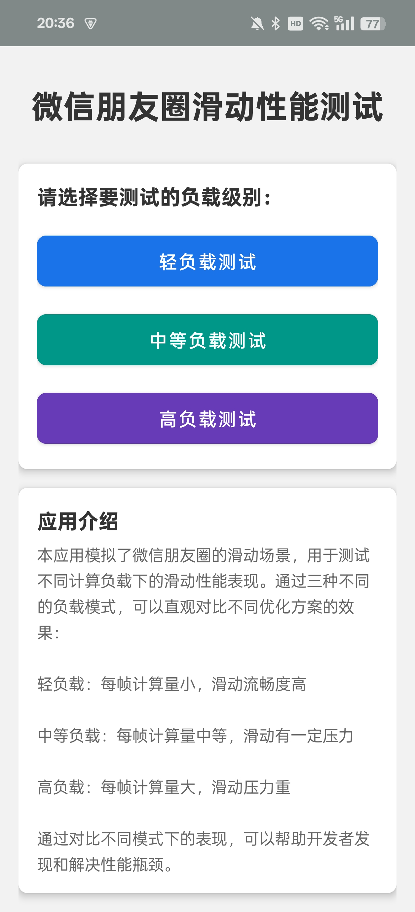
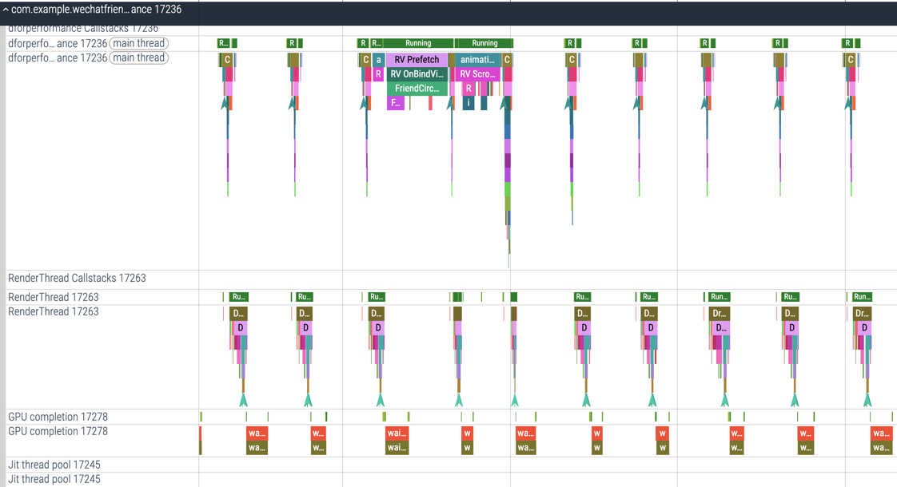

# 微信朋友圈测试 Demo

## 📊 项目状态

本项目是一个基于微信朋友圈 UI 的性能测试平台，旨在研究 Android 滑动性能和功耗表现。项目包含四个主要模块，分别用于不同方面的测试和研究。

*Read this in [English](README_EN.md)*

## APK 说明
1. app-releas : 原项目 App，进去后是一个随机展示的 微信朋友圈 界面，仅作保留使用。
2. wechatfriendforperformance-release ：用来测试性能的 App，使用标准的 AOSP 实现。进去后有三种负载可以选择，主要测试平台性能 or Power。
3. wechatfriendforpower-release：原项目 App 魔改，进去后是一个固定显示内容的 微信朋友圈 界面，每次进去显示的内容和每个位置的 item 都是一样的，用来测试固定性能 or Power。
4. wechatfriendforwebview-release ：用来测试性能的 App，使用标准的 WebView 实现。进去后有三种负载可以选择，主要测试平台性能  or Power。

## 项目结构

本项目包含四个主要模块:

### 1. 原始项目 (app)

原始的高性能微信朋友圈实现，来自 fork 的项目。这个模块展示了如何高效实现类似微信朋友圈的滑动列表，包含多种性能优化技巧。

### 2. 性能测试模块 (wechatfriendforperformance)

专门设计用于测试和比较不同负载下的滑动性能表现。包含三种负载模式：

- **轻负载测试**: 每帧计算量小，滑动流畅度高
- **中等负载测试**: 每帧计算量中等，滑动有一定压力
- **高负载测试**: 每帧计算量大，滑动压力重

该模块在关键代码处添加了 Trace 点，方便使用 Perfetto 等工具进行性能分析和优化。

### 3. 功耗测试模块 (wechatfriendforpower)

主要是单 Activity，每次进去环境都一模一样，内容也不会发生变化。

### 4. WebView测试模块 (wechatfriendforwebview)

使用WebView实现朋友圈界面，用于测试WebView与原生实现在性能方面的差异。包含三种负载级别：

- **轻负载WebView**: 基础渲染，无额外负载
- **中负载WebView**: 添加适量JavaScript和DOM操作
- **重负载WebView**: 添加密集JavaScript计算和DOM操作

该模块实现了JavaScript与Java交互，支持动态加载最多200条朋友圈数据，解决了滑动到底部闪烁的问题。

## 性能优化策略

在 Android 中，要避免列表卡顿，主要从以下几个角度进行优化：

- 减少布局层级，避免过多的 Item View 的无用布局嵌套
- 滑动时控制图片加载，停止滑动后再加载图片
- 避免在 Adapter 填充数据时做过多计算，复杂计算应在数据准备阶段完成
- 在数据 Bean 中完成数据变换操作，如将 String 转换为 SpannableStringBuilder
- 减少 onMeasure() 和 onLayout() 的调用次数
- 实现 View 对象的缓存，减少 View 的创建

## 如何使用

1. 运行 `app` 模块查看原始的高性能朋友圈实现
2. 运行 `wechatfriendforperformance` 模块进行性能测试：
   - 选择不同的负载级别
   - 使用 Perfetto 或其他性能分析工具收集数据
   - 分析 Trace 结果进行性能优化
3. 运行 `wechatfriendforpower` 模块测试功耗表现
4. 运行 `wechatfriendforwebview` 模块测试WebView性能：
   - 选择不同的负载级别
   - 体验不同负载下WebView的滑动流畅度
   - 滑动到底部测试动态加载功能

## 性能测试对比

通过对比不同实现方式和不同负载级别下的性能表现，可以得到以下结论：

1. 原生实现在各种负载条件下都表现优异
2. WebView实现在轻负载条件下表现接近原生，但随着负载增加，性能下降更为明显
3. 在处理大量数据时，动态加载机制可以有效提升用户体验
4. 功耗测试显示，优化的滑动实现能够显著延长电池寿命

## 特别鸣谢

感谢原项目作者 [KCrason](https://github.com/KCrason) 的杰出工作和 [razerdp](https://github.com/razerdp) 提供的 View 缓存思路。本项目在原有基础上进行了扩展，增加了专门的性能、功耗和WebView测试模块。

## 未来计划

未来可能会继续更新该项目，包括但不限于：
- 添加更多性能测试指标
- 改进功耗测试精度
- 实现表情匹配
- 实现电话号码匹配等功能
- 增加Compose实现版本，对比更多技术方案

欢迎 Star 和贡献！

## 📱 下载应用

### 🚀 自动构建版本
每次代码更新后，GitHub Actions会自动构建最新版本的APK文件。你可以在[Releases页面](../../releases)下载：

- **HighPerformanceFriendsCircle-debug** - 主应用模块
- **WeChatFriendForPerformance-debug** - 性能测试模块
- **WeChatFriendForPower-debug** - 功耗测试模块  
- **WeChatFriendForWebView-debug** - WebView测试模块

### 📋 版本说明
- **Debug版本**: 包含调试信息，可直接安装使用
- **Release版本**: 优化版本，需要签名后才能发布

> 💡 **提示**: Debug版本适合体验和测试，Release版本适合正式使用

## 🔧 开发者指南

### 自动化构建和发布
本项目配置了完整的CI/CD流程：

- **自动构建**: 每次push到master分支自动构建所有模块
- **自动发布**: 构建成功后自动创建GitHub Release
- **手动发布**: 支持手动触发带版本号的正式发布

详细配置说明请查看 [RELEASE_SETUP.md](RELEASE_SETUP.md)

### 签名配置
如需配置APK签名，请参考 [SIGNING_CONFIG_EXAMPLE.md](SIGNING_CONFIG_EXAMPLE.md)

# 项目截图

