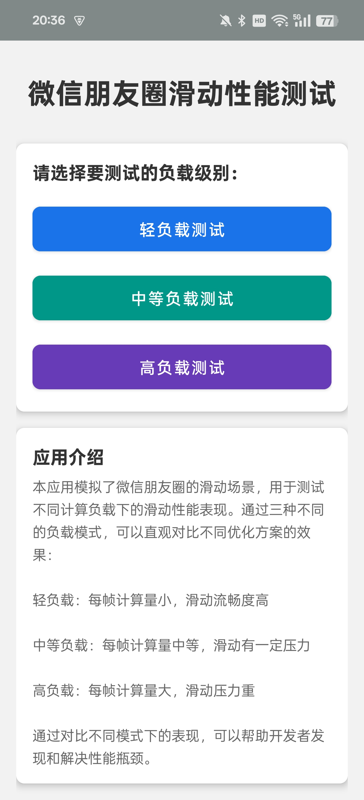
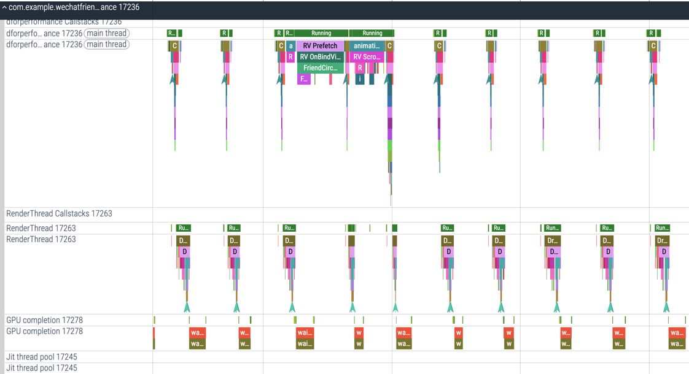

# High Performance WeChat Friend Circle Demo

This project is a performance testing platform based on WeChat Friend Circle UI, designed to study Android scrolling performance and power consumption. The project contains four main modules for testing and research in different aspects.

*Read this in [Chinese](README.md)*

## Project Structure

This project contains four main modules:

### 1. Original Project (app)

The original high-performance WeChat Friend Circle implementation, from the forked project. This module demonstrates how to efficiently implement a scrolling list similar to WeChat Friend Circle, including various performance optimization techniques.

### 2. Performance Testing Module (wechatfriendforperformance)

Specifically designed to test and compare scrolling performance under different loads. Contains three load modes:

- **Light Load Test**: Small computation per frame, high scrolling smoothness
- **Medium Load Test**: Medium computation per frame, some scrolling pressure
- **Heavy Load Test**: Large computation per frame, heavy scrolling pressure

This module has added Trace points at key code locations, facilitating performance analysis and optimization using tools like Perfetto.

### 3. Power Consumption Testing Module (wechatfriendforpower)

Specifically designed to test the impact of different scrolling implementation strategies on device power consumption. Can be used to study the impact of optimization strategies on battery life.

### 4. WebView Testing Module (wechatfriendforwebview)

Implements the Friend Circle interface using WebView to test performance differences between WebView and native implementation. Contains three load levels:

- **Light Load WebView**: Basic rendering with no additional load
- **Medium Load WebView**: Adds moderate JavaScript and DOM operations
- **Heavy Load WebView**: Adds intensive JavaScript computation and DOM operations

This module implements JavaScript and Java interaction, supports dynamic loading of up to 200 Friend Circle data items, and resolves the flickering issue when scrolling to the bottom.

## Performance Optimization Strategies

In Android, to avoid list stuttering, optimize from the following aspects:

- Reduce layout hierarchy, avoid excessive nesting of Item Views
- Control image loading during scrolling, load images after scrolling stops
- Avoid excessive computation when filling data in Adapter, complex calculations should be completed in the data preparation stage
- Complete data transformation operations in the data Bean, such as converting String to SpannableStringBuilder
- Reduce the number of calls to onMeasure() and onLayout()
- Implement View object caching to reduce View creation

## How to Use

1. Run the `app` module to view the original high-performance Friend Circle implementation
2. Run the `wechatfriendforperformance` module for performance testing:
   - Select different load levels
   - Use Perfetto or other performance analysis tools to collect data
   - Analyze Trace results for performance optimization
3. Run the `wechatfriendforpower` module to test power consumption performance
4. Run the `wechatfriendforwebview` module to test WebView performance:
   - Select different load levels
   - Experience scrolling smoothness under different loads
   - Scroll to the bottom to test dynamic loading functionality

## Performance Test Comparison

By comparing performance under different implementation methods and load levels, the following conclusions can be drawn:

1. Native implementation performs excellently under all load conditions
2. WebView implementation performs close to native under light load conditions, but as load increases, performance degradation becomes more apparent
3. When handling large amounts of data, dynamic loading mechanism can effectively improve user experience
4. Power consumption tests show that optimized scrolling implementation can significantly extend battery life

## Special Thanks

Thanks to the original project author [KCrason](https://github.com/KCrason) for the outstanding work and [razerdp](https://github.com/razerdp) for providing the View caching approach. This project has been extended on the original basis, adding dedicated performance, power consumption, and WebView testing modules.

## Future Plans

This project may continue to be updated in the future, including but not limited to:
- Adding more performance test metrics
- Improving power consumption test accuracy
- Implementing emoji matching
- Implementing phone number matching and other features
- Adding Compose implementation version to compare more technical solutions

Star and contributions welcome!

## Project Status

 