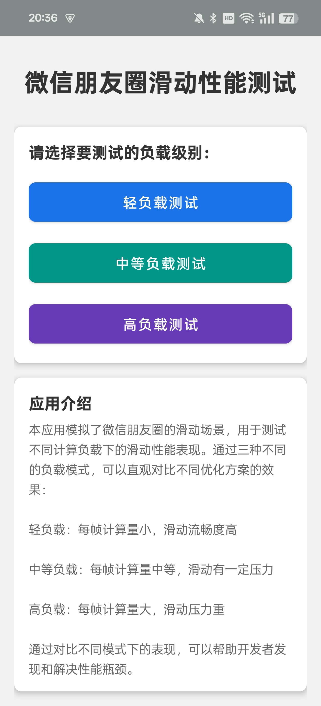
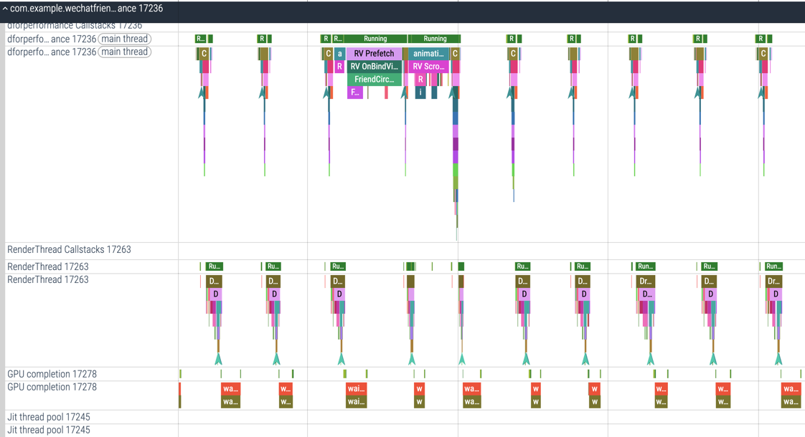

# WeChat Friend Circle Demo

## 📊 Project Status

This project is a performance testing platform based on WeChat Friend Circle UI, designed to study Android scrolling performance and power consumption. The project ships 32 modules (28 app + 4 shared libraries) covering CPU-heavy, RenderThread-heavy, power-sensitive and WebView scenarios.

*Read this in [Chinese](README.md)*

## Tech Stack

| Item | Version |
|------|---------|
| Android Gradle Plugin | 8.7.3 |
| Kotlin | 2.0.21 |
| compileSdk | 35 |
| minSdk | 24 |
| Jetpack Compose BOM | 2024.12.01 |

**Build System Features:**
- **Version Catalog** (`gradle/libs.versions.toml`): Centralized dependency version management
- **Convention Plugin** (`build-logic/`): Unified Android App / Library / Compose build configuration
- **Configuration Cache**: Faster incremental builds

## Load Types

All test modules support 11 load types covering different performance testing scenarios:

| Type | Load Name | Description |
|------|-----------|-------------|
| Minimal | Minimal Load | No additional load |
| In-Frame Light | In-Frame Light Load | Light computation within each frame |
| In-Frame Medium | In-Frame Medium Load | Medium computation within each frame |
| In-Frame Heavy | In-Frame Heavy Load | Heavy computation within each frame |
| Between-Frame Light | Between-Frame Light Load | Light tasks between frames |
| Between-Frame Medium | Between-Frame Medium Load | Medium tasks between frames |
| Between-Frame Heavy | Between-Frame Heavy Load | Heavy tasks between frames |
| Mixed Light | Mixed Light Load | Both in-frame and between-frame light loads |
| Mixed Medium | Mixed Medium Load | Both in-frame and between-frame medium loads |
| Mixed Heavy | Mixed Heavy Load | Both in-frame and between-frame heavy loads |
| **Long Frame** | **Long Frame Load** | **2-3 random super-long frames (HEAVY×10) during scrolling** |

## Project Structure

The project is organized by implementation type:

### Shared Library Modules

| Module Directory | Description |
|-----------------|-------------|
| `load-config` | Centralized load simulation config (11 load types, intensity params, scheduling) |
| `scrolling-common` | Shared scrolling code (Beans, interfaces, custom views, utilities, resources) |
| `launch-common` | Shared launch code (3 Flavors: Light/Medium/Heavy) |
| `switch-common` | Shared switch code (10 load combinations, XML Inflate, custom Views) |

### Scrolling Modules (Standard Android UI + RenderThread)

| Module Directory | Description |
|-----------------|-------------|
| `app` | Original project with random Friend Circle display |
| `scrolling-aosp-performance` | Performance testing with 11 load types |
| `scrolling-aosp-power` | Power consumption testing with fixed content |
| `scrolling-aosp-picasso` | Using Picasso image loading library |
| `scrolling-aosp-customscroller` | Custom CustomOverScroller + CustomTimelineView |
| `scrolling-aosp-renderstress` | RenderThread stress testing |
| `scrolling-aosp-softwarerender` | Software rendering (hardware acceleration disabled) |
| `scrolling-aosp-douyin` | Douyin-style video scrolling |
| `scrolling-aosp-video` | Video Feed version |
| `scrolling-aosp-ebook` | E-Book Reader demo |
| `scrolling-aosp-purerenderthread` | Pure RenderThread list scrolling |
| `scrolling-aosp-dualwindow` | Dual Window rendering demo |
| `scrolling-aosp-mixedrender` | Mixed rendering demo |
| `scrolling-compose` | Jetpack Compose implementation |

### Launch Performance Modules

| Module Directory | Description |
|-----------------|-------------|
| `launch-aosp` | Standard Android UI launch test (Light/Medium/Heavy) |
| `launch-compose` | Jetpack Compose launch test (State churn stress) |
| `launch-webview` | WebView Hybrid launch test (DOM/JSON stress) |
| `launch-gl` | OpenGL ES launch test (Texture/State stress) |
| `launch-game` | Game engine launch test (Physics/AI/Texture loading stress) |

### Switch Modules (In-App Navigation Performance)

| Module Directory | Description |
|-----------------|-------------|
| `switch-aosp` | Standard Android UI navigation test (10 load combinations) |
| `switch-flutter` | Flutter-style Canvas rendering navigation test (10 load combinations) |
| `switch-webview` | WebView hybrid navigation test (10 load combinations) |

### WebView Modules

| Module Directory | Description |
|-----------------|-------------|
| `scrolling-webview` | Standard WebView implementation |
| `scrolling-webview-surface` | WebView + SurfaceView |
| `scrolling-webview-texture` | WebView + TextureView |
| `scrolling-webview-imagereader` | WebView + ImageReader |

### Surface & GL Modules

| Module Directory | Description |
|-----------------|-------------|
| `scrolling-surface-map` | SurfaceView Map Demo |
| `scrolling-gl-map` | OpenGL ES 2.0 Map Demo |

## Module Details

### 1. Original Project (app)

The original high-performance WeChat Friend Circle implementation, from the forked project. This module demonstrates how to efficiently implement a scrolling list similar to WeChat Friend Circle, including various performance optimization techniques.

### 2. Performance Testing Module (scrolling-aosp-performance)

Specifically designed to test and compare scrolling performance under different loads. Supports 11 load modes with Trace points at key code locations for performance analysis using tools like Perfetto.

### 3. Power Consumption Testing Module (scrolling-aosp-power)

Single Activity design with fixed environment and content for precise power consumption testing.

### 4. WebView Testing Module (scrolling-webview)

Implements the Friend Circle interface using WebView to test performance differences between WebView and native implementation. Supports 11 load levels with JavaScript-Java interaction and dynamic loading of up to 200 items.

### 5. Custom Scroller Module (scrolling-aosp-customscroller)

- Replaces RecyclerView/ListView with custom `CustomTimelineView` + `CustomOverScroller`
- Built with Hilt + MVVM + Room data pipeline
- Supports 11 load types for evaluating OEM optimizations

### 6. RenderThread Stress Module (scrolling-aosp-renderstress)

- Based on custom scroller architecture with `CustomOverScroller`
- `RenderStressOverlayView` applies blur/shader chains during scrolling
- Supports 11 load types for GPU/vsync analysis

### 7. Software Rendering Module (scrolling-aosp-softwarerender)

Software rendering mode implementation (hardware acceleration disabled):

- **Hardware Acceleration Disabled**: Configured via `android:hardwareAccelerated="false"`
- **UI Thread Only**: No RenderThread, all rendering on main thread
- Supports 11 load types for CPU-intensive testing

### 8. Compose Module (scrolling-compose)

Jetpack Compose implementation:

- **Declarative UI**: Built with Kotlin + Compose
- **LazyColumn**: Replaces RecyclerView
- **Coil Image Loading**: Compose-friendly image loading
- Supports 11 load types for framework performance comparison

### 9. SurfaceView Map Module (scrolling-surface-map)

Amap-style map demo application:

- **SurfaceView Map**: Renders map grid on separate thread using SurfaceView
- **Native Control Overlay**: Top navigation bar and bottom control panel use native Views
- **Scroll Gesture Support**: Supports drag and fling scrolling
- Supports 11 load types for testing SurfaceView + native View mixed scenarios

### 10. Pure RenderThread Module (scrolling-aosp-purerenderthread)

Pure RenderThread list scrolling implementation:

- **Zero UI Thread Rendering**: Main thread only handles touch events, no drawing
- **Dedicated Render Thread**: All drawing operations on separate rendering thread
- **SurfaceView Implementation**: Utilizes SurfaceView's independent Surface
- Supports 11 load types for validating pure render thread performance

### 11. Dual Window Module (scrolling-aosp-dualwindow)

Dual window rendering demonstration:

- **Two Simultaneous Windows**: Main window + overlay window
- **Dual doFrame Callbacks**: 2 doFrame per vsync in systrace
- **Dual RenderThread**: 2 RenderThread drawFrame per vsync
- **Overlay Permission Required**: Uses WindowManager for second window
- Supports 11 load types for testing multi-window scenarios

### 12. Mixed Rendering Module (scrolling-aosp-mixedrender)

Mixed rendering combining two pipelines:

- **Pure RenderThread Animation**: SurfaceView with dedicated render thread (top)
- **Standard UI+RenderThread**: RecyclerView with normal View hierarchy (bottom)
- **Simulates Video Overlay**: Like video player overlay on scrollable list
- Supports 11 load types for analyzing mixed rendering performance

### 13. OpenGL Map Module (scrolling-gl-map)

OpenGL ES 2.0 map rendering demo:

- **GLSurfaceView**: Hardware-accelerated OpenGL rendering
- **Map Features**: Grid, roads, buildings, and markers
- **Gesture Support**: Pan and pinch-to-zoom
- **Native UI Overlays**: Search bar and control buttons
- Supports 11 load types for GPU-intensive testing

### 14. Douyin-style Video Module (scrolling-aosp-douyin)

Simulates Douyin's full-screen video scrolling experience:

- **Full-screen Video**: Each video occupies the entire screen for immersive experience
- **Custom Scroll Container**: `VerticalVideoScroller` + `VideoOverScroller` for page-style scrolling
- **Speed-aware Animation**: Scroll duration ranges from 200ms to 600ms based on velocity
- **Smart Switching**: Auto-switch when scrolled past midpoint
- **Perfect UI Recreation**: Bottom navigation, right-side interaction buttons, bottom-left info area
- Uses Media3 ExoPlayer for video playback

### 15. E-Book Reader Module (scrolling-aosp-ebook)

Simulates e-book reader page-turning experience:

- **EPUB Support**: Supports standard EPUB format e-book parsing
- **Touch Navigation**: Tap left for previous page, tap right for next page, tap center to show menu
- **Swipe Navigation**: Supports left/right swipe with smooth animation
- **Reading Menu**: Top and bottom menus (simulated) with contents, brightness, font size, theme, settings
- **Progress Display**: Page number at bottom, supports progress bar quick jump
- **Immersive Reading**: Full-screen mode with warm yellow eye-care background
- Loads "巨婴国" (Giant Baby Nation) e-book by default

### 16. Launch Performance Modules (launch-*)

A suite of demos specifically designed to test App startup performance across different technology stacks, simulating complex real-world startup scenarios.

**Key Features:**
- **Interleaved Loading**: Simulates fragmented CPU, IO, Binder, and Memory operations on the main thread.
- **Domain-Specific High-Fidelity Loads**:
    - **AOSP**: Simulates View Inflation (Reflection/Recursion) stress.
    - **Compose**: Simulates complex List generation, filtering/sorting (ViewModel logic), and State Snapshot (Recomposition) stress.
    - **WebView**: Simulates DOM Thrashing (Layout Reflows), huge JSON parsing, and heavy JS business logic execution.
    - **OpenGL**: Simulates Shader Compilation (Multi-material), Level Data IO reading, Game Logic Init (Physics/AI), and Texture upload stress.
- **Lifecycle Awareness**: Loads are distributed across `Application.onCreate`, `Activity.onCreate`, `onStart` (Blocking wait), and `onResume` stages.
- **Async Network Simulation**: Uses Coroutines to simulate network latency with jitter and progressive data fetching.
- **Multi-dimensional Load**: Provides Light, Medium, and Heavy flavors, corresponding to different startup time targets (100ms - 3s+).

## Performance Optimization Strategies

In Android, to avoid list stuttering, optimize from the following aspects:

- Reduce layout hierarchy, avoid excessive nesting of Item Views
- Control image loading during scrolling, load images after scrolling stops
- Avoid excessive computation when filling data in Adapter
- Complete data transformation in data Beans
- Reduce calls to onMeasure() and onLayout()
- Implement View object caching

## How to Use

1. Run the `app` module to view the original high-performance Friend Circle implementation
2. Run the `scrolling-aosp-performance` module for performance testing:
   - Select any of the 11 load levels
   - Use Perfetto or other performance analysis tools
   - Analyze Trace results for optimization
3. Run the `scrolling-aosp-power` module to test power consumption
4. Run the `scrolling-webview` module to test WebView performance
5. Run the `scrolling-aosp-customscroller` module to evaluate custom scroller
6. Run the `scrolling-aosp-renderstress` module for RenderThread analysis

## Performance Test Comparison

By comparing performance under different implementation methods and load levels:

1. Native implementation performs excellently under all conditions
2. WebView performance degrades more noticeably as load increases
3. Dynamic loading improves user experience with large datasets
4. Optimized scrolling significantly extends battery life

## Special Thanks

Thanks to KCrason for the original project and [razerdp](https://github.com/razerdp) for View caching concepts.

## Future Plans

- Adding more performance test metrics
- Improving power consumption test accuracy
- Implementing emoji matching
- Adding more implementation versions

Star and contributions welcome!

## Screenshots

